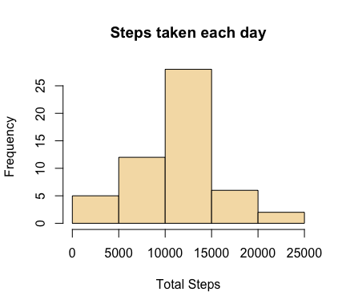
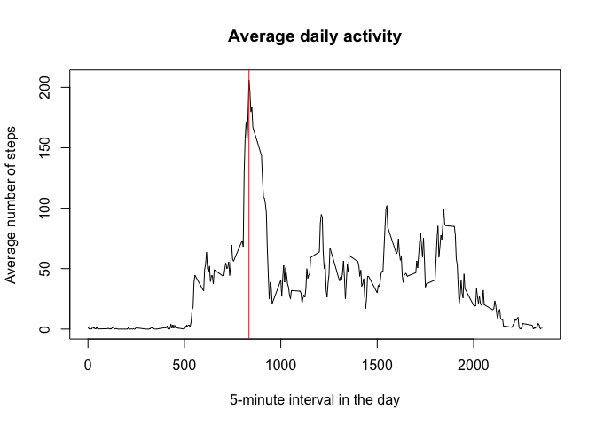
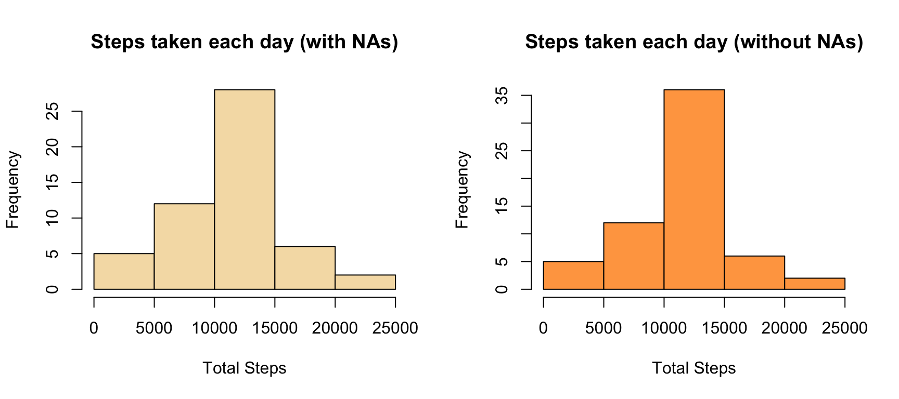
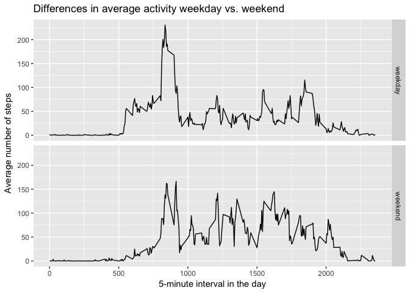

# Reproducible Research: Peer Assessment 1

## Loading and preprocessing the data

I use the various packages in the `tidyverse` (such as `dplyr`) for data 
wrangling, so I need to load the packages with:


```r
suppressPackageStartupMessages(library(tidyverse))
```

Then, we can simply import the data:


```r
unzip("activity.zip")
activityData <- read_csv("activity.csv", col_types = "iDi")
```


## What is mean total number of steps taken per day?

Here, the activity data is summarized to produce an histogram of the total number
of steps taken each day.


```r
totalSteps <- activityData %>% 
	group_by(date) %>% 
	summarize(steps = sum(steps))

hist(totalSteps$steps, col = "wheat",
     main = "Steps taken each day", xlab = "Total Steps")
```

<!-- -->

Then, we calculate the mean and the median of the total number of steps.


```r
meanSteps <- mean(totalSteps$steps, na.rm = TRUE)
meanSteps
```

```
## [1] 10766.19
```

```r
medianSteps <- median(totalSteps$steps, na.rm = TRUE)
medianSteps
```

```
## [1] 10765
```

## What is the average daily activity pattern?

To give an overview of the average daily activity, we calculate the average 
activity (**steps**) across all days, and plot it against the 5-minute interval 
*in each day*.  

We then calculate the moment in the day with the maximum average activity, and 
also add it to the graph with a red vertical line.


```r
averageActivity <- activityData %>% 
	group_by(interval) %>% 
	summarize(steps = mean(steps, na.rm = TRUE))

with(averageActivity,
     plot(interval, steps, type = "l", main = "Average daily activity",
          xlab = "5-minute interval in the day", ylab = "Average number of steps"))

maxValue <- averageActivity[averageActivity$steps == max(averageActivity$steps), ]
abline(v = maxValue$interval, col = "red")
```

<!-- -->

```r
maxValue$interval
```

```
## [1] 835
```

## Imputing missing values

There are a number of days/intervals where there are missing values: we need 
to analyze the problem a bit in order to understand if it's necessary to input 
some of the missing value to have more reliable calculations and summaries.

Out of 17568 total observations, the number of incomplete 
cases (i.e. with at least one missing value) is equal to:


```r
sum(!complete.cases(activityData))
```

```
## [1] 2304
```

This means that 13.11% 
of the rows are incomplete.

To fill in the missing values, I decided to simply use the mean value for that 
5-minute interval. The mean is a **numeric** variable, but I decided to round 
the value to the nearest **integer**, to be consistent with the original data frame.

The following code inputs the missing values and creates a new data frame called
`completeData`:


```r
incompleteData <- activityData[!complete.cases(activityData), ]
filledData <- merge(incompleteData, averageActivity, by = "interval",
		    all.x = TRUE, all.y = FALSE)
filledData <- filledData %>% 
	mutate(steps = as.integer(steps.y)) %>%  # Rounding to the nearest integer
	select(steps, date, interval) %>% 
	tbl_df

completeData <- activityData[complete.cases(activityData), ]
completeData <- rbind(completeData, filledData) %>% 
	arrange(date, interval)
```

As requested, I now recalculate both the histogram, the mean and the median values.


```r
newTotalSteps <- completeData %>% 
	group_by(date) %>% 
	summarize(steps = sum(steps))

par(mfrow = c(1, 2))
hist(totalSteps$steps, col = "wheat",
     main = "Steps taken each day (with NAs)", xlab = "Total Steps")
hist(newTotalSteps$steps, col = "tan1",
     main = "Steps taken each day (without NAs)", xlab = "Total Steps")
```

<!-- -->

```r
newMeanSteps <- mean(newTotalSteps$steps, na.rm = TRUE)
newMedianSteps <- median(newTotalSteps$steps, na.rm = TRUE)
tab <- data.frame(With.NAs = c(meanSteps, medianSteps),
		  Without.NAs = c(newMeanSteps, newMedianSteps),
		  row.names = c("Mean", "Median"))
print(tab)
```

```
##        With.NAs Without.NAs
## Mean   10766.19    10749.77
## Median 10765.00    10641.00
```

Filling in the missing values produced an alteration in the summaries: the new 
mean is lower than before (**-0.15%** 
variation), and also the median is lower (
**-1.15%** variation).

## Are there differences in activity patterns between weekdays and weekends?

Here I create a new variable to indicate whether a day is a **weekday** or
a **weekend** day.


```r
Sys.setlocale("LC_TIME", "en_US.UTF-8") # Forcing English locale
```

```
## [1] "en_US.UTF-8"
```

```r
library(forcats)
weekday <- as.factor(weekdays(completeData$date, abbreviate = TRUE))
completeData$day.type <- fct_recode(weekday,
				    "weekday" = "Mon", "weekday" = "Tue",
				    "weekday" = "Wed", "weekday" = "Thu",
				    "weekday" = "Fri",
				    "weekend" = "Sat", "weekend" = "Sun")
```

Then, I use the `ggplot2` package to create the panel plot:


```r
library(ggplot2)
by_daytype <- completeData %>% 
	group_by(day.type, interval) %>% 
	mutate(averageSteps = mean(steps))

g <- ggplot(by_daytype, aes(interval, averageSteps))
g + facet_grid(day.type ~ .) +
	geom_line() +
	labs(x = "5-minute interval in the day", y = "Average number of steps",
	     title = "Differences in average activity weekday vs. weekend")
```

<!-- -->

Note that the average activity is different depending on the day type.
